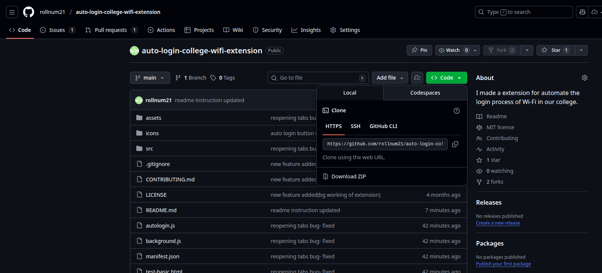
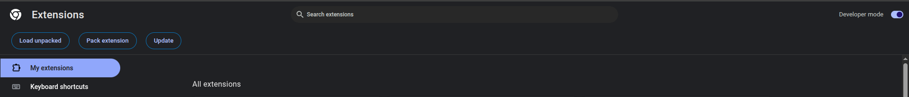

# Auto Login College Wi-Fi Extension

This Chrome extension automates the login process for your college Wi-Fi network, saving you time and hassle every time you connect.

## Features
- Automatically detects college Wi-Fi and logs in with your credentials
- Zero-polling passive monitoring (minimal CPU usage)
- Manual connect button for instant login
- Works silently in the background
- Simple setup and configuration

## Installation

### Method 1: Download ZIP from GitHub

1. **Download the extension**
   - Go to the GitHub repository: https://github.com/rollnum21/auto-login-college-wifi-extension
   - Click the green "Code" button
   - Select "Download ZIP"
   
   

2. **Extract the ZIP file**
   - Locate the downloaded ZIP file in your Downloads folder
   - Right-click the ZIP file and select "Extract All..." (Windows) or double-click (Mac/Linux)
   - Remember the location where you extracted the files

   

3. **Open Chrome Extensions page**
   - Open Google Chrome browser
   - Type `chrome://extensions/` in the address bar and press Enter
   - Or click the three dots menu (top right) > More tools > Extensions

4. **Enable Developer Mode**
   - Look for the "Developer mode" toggle in the top-right corner
   - Click the toggle to turn it ON (it should turn blue)

   

5. **Load the extension**
   - Click the "Load unpacked" button (appears after enabling Developer mode)
   - Navigate to the folder where you extracted the ZIP file
   - Select the `auto-login-college-wifi-extension` folder (the main folder containing manifest.json)
   - Click "Select Folder" or "Open"

   

6. **Verify installation**
   - The extension should now appear in your extensions list
   - You should see "Auto Login College Wi-Fi" with a green/blue icon
   - Pin the extension to your toolbar for easy access (click the puzzle piece icon, then the pin icon)

   

### Method 2: Clone from Git

1. Clone this repository:
   ```sh
   git clone https://github.com/krishnaguptta/auto-login-college-wifi-extension.git
   ```
2. Open Chrome and go to `chrome://extensions/`
3. Enable "Developer mode" (top right)
4. Click "Load unpacked" and select the project folder
5. Configure your credentials in the extension popup

## Configuration

1. **Open the extension**
   - Click the extension icon in your Chrome toolbar
   - Or click the puzzle piece icon and select "Auto Login College Wi-Fi"

   

2. **Enter your credentials**
   - Enter your admission number/username in the "Username" field
   - Enter your Wi-Fi password in the "Password" field
   - Click "Save" button

   

3. **Test the connection**
   - Click the "Connect Now" button to test manual login
   - The button will change color to show connection status:
     - Blue = Ready
     - Orange = Connecting
     - Green = Success
     - Red = Error

   

## Usage

Once configured, the extension works automatically:

- Detects when you lose internet connection
- Automatically logs in to the Wi-Fi portal in the background
- Shows status updates via badge icon (ON/LOG/OFF/ERR)
- Use "Connect Now" button for instant manual login

No further action required. Enjoy seamless Wi-Fi connectivity without manual logins.

## Contributing
Contributions are welcome!

1. Fork the repository
2. Create your feature branch (`git checkout -b feature/AmazingFeature`)
3. Commit your changes (`git commit -m 'Add some feature'`)
4. Push to the branch (`git push origin feature/AmazingFeature`)
5. Open a Pull Request

Please make sure your code follows the existing style and includes relevant documentation.

## License
MIT
